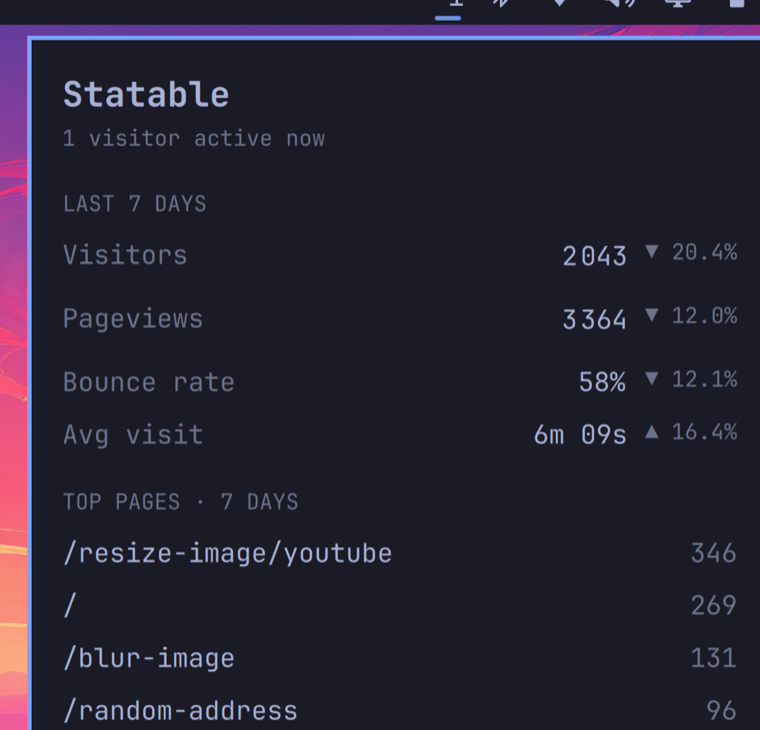

# Statable visitors — an Omarchy bar widget

Visitors on your site in the [Omarchy](https://omarchy.org) bar: a live count as a
pill, and the last seven days when you click it. It polls the
[`statable`](https://github.com/key-arg/statable-cli) CLI, which prints and exits, so
the widget holds no state and runs no daemon.



## Requires

- Omarchy with the Quickshell bar — the one that reads `~/.config/omarchy/shell.json`.
- The [`statable`](https://github.com/key-arg/statable-cli) CLI on the shell's
  `PATH`, signed in to an account. Install it from its
  [releases page](https://github.com/key-arg/statable-cli/releases) or with a Go
  toolchain — see the CLI's README — then:

  ```bash
  statable auth login          # paste an API key with the read scope
  statable sites use example.com
  ```

## Install

```bash
omarchy plugin add https://github.com/key-arg/omarchy-statable.git
```

It lands disabled, as every third-party plugin does — read `Widget.qml` (it is
short), then enable **Statable visitors** in the bar settings, or add it to a
section of `~/.config/omarchy/shell.json`:

```jsonc
{ "id": "com.statable.now" }
```

## Settings

| Setting | Default | What it does |
|---|---|---|
| `site` | *(blank)* | Domain or id to read. Blank uses whatever `statable sites use` set as the default. |
| `refreshIntervalSec` | `60` | How often to poll. The now-count changes slowly, and each poll is one API request against your hourly budget. |
| `showIcon` | `true` | Show the visitors glyph before the number. |

## Behaviour

The pill shows a number only when `statable now` exits cleanly. Clicking it opens
a panel with the last seven days — visitors, pageviews, bounce rate and average
visit, each against the previous week — and the top pages; those are fetched when
the panel opens and on the same timer while it stays open.

No key, no default site, the API unreachable, or the binary missing from `PATH` —
each leaves that part blank rather than showing a wrong or stale figure. Every
call runs off the bar's UI thread, so a slow one never freezes the bar, and a
poll still running when the next tick arrives is skipped rather than stacked.

Every call is bounded: 15 seconds and 64 KiB of output, after which the
process is killed and its output dropped. What does come back is checked
before it is shown — the count must be digits, the figures finite numbers, the
top pages at most five with paths cut at 200 characters — and every value from
the API is rendered as plain text, never as rich text.

Middle-click re-polls immediately. The panel can also be summoned by script:
`omarchy-shell com.statable.now toggle`.

## Remove

```bash
omarchy plugin remove com.statable.now
```

That deletes the plugin's folder under `~/.config/omarchy/plugins/` and its entry in `shell.json`. Nothing else is touched.

## Licence

MIT. The widget is unsandboxed QML that runs inside `omarchy-shell`, like every
Omarchy plugin: read it before you enable it.
